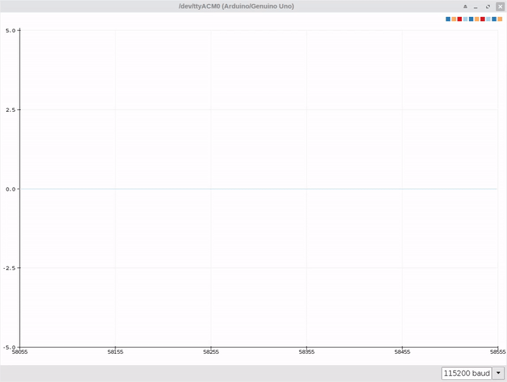

# Connecting ESP01 to ADC0838 via SPI
More info [here](https://z4ziggy.wordpress.com/2019/06/16/esp01-serial-spi/)
## Wiring
```
ESP PIN #10 (CS)    -> ADC PIN #18
ESP PIN #11 (DI/DO) -> ADC PIN #14 & ADC PIN #17
ESP PIN #12 (CLK)   -> ADC PIN #16
```
## Demo

